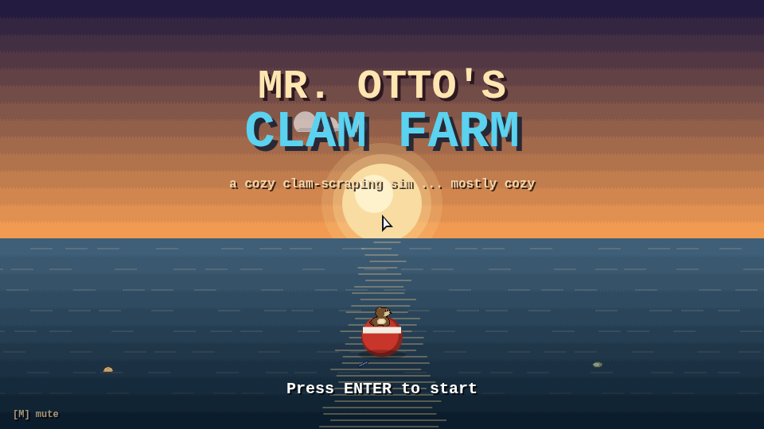
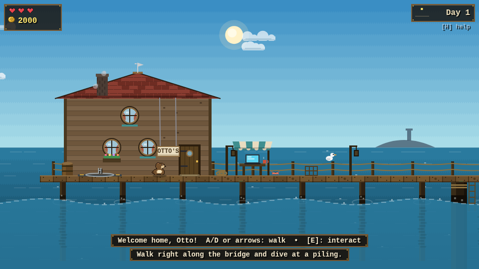
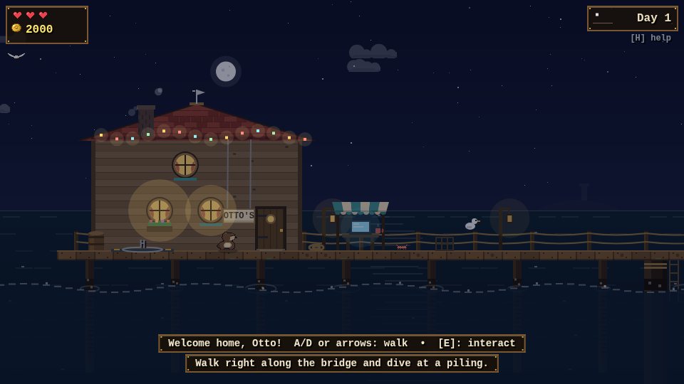
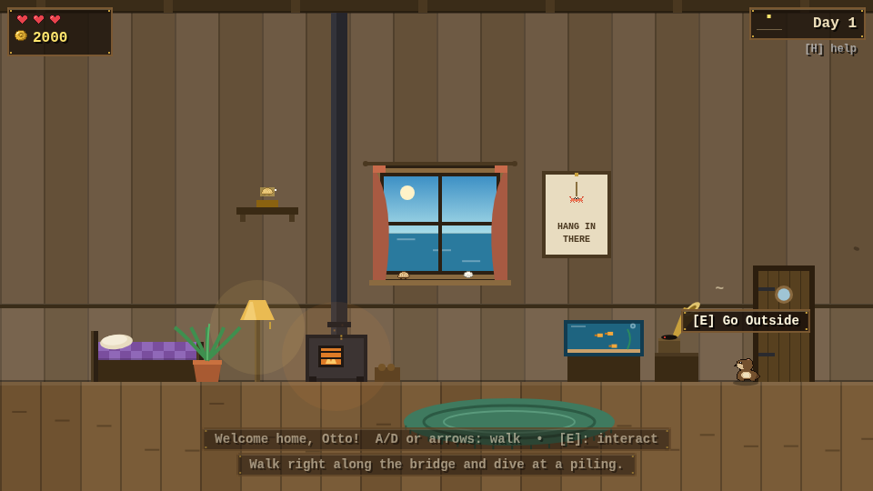
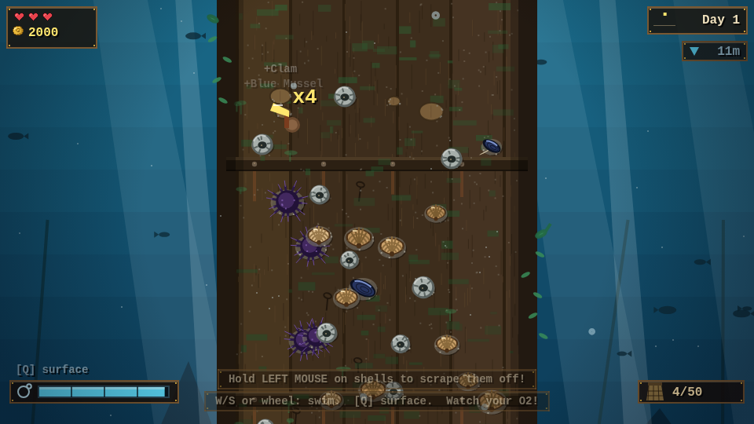
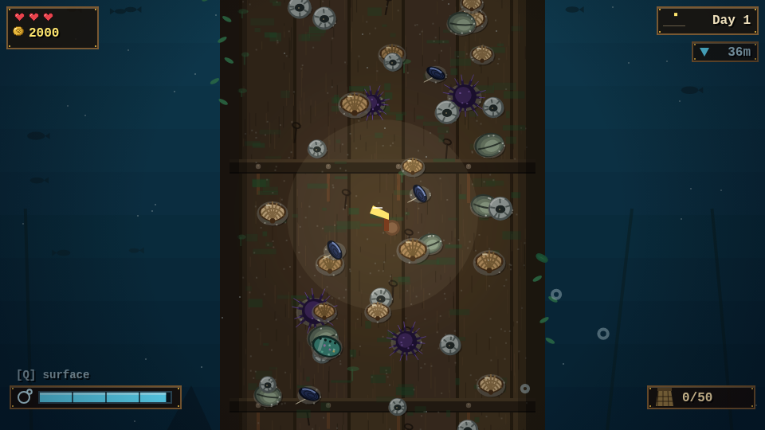
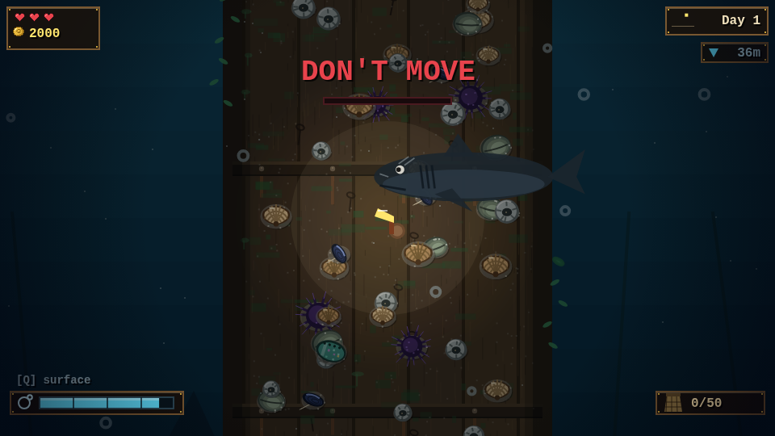
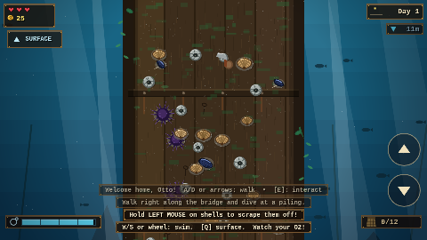

# Mr. Otto's Clam Farm 🦦🦪

A 2D pixel-art **cozy farming game — with teeth**. You are Otto, an otter
running a clam farm from a little stilt house in the middle of the sea.
Scrape clams and barnacles off the bridge pilings, sell your haul online,
and wait for the delivery drone... but the deep water is not always friendly.

**No build step, no dependencies.** Just open `index.html` in a browser
(or serve the folder with any static server).

```
python3 -m http.server 8000   # then visit http://localhost:8000
```

Works with **mouse + keyboard or pure touch** — on a phone, on-screen
buttons appear automatically (hold the arrows to walk/swim, hold your paw
on shells to scrape, tap the paw button to interact).

| | |
|---|---|
|  |  |
|  |  |
|  |  |
|  |  |

## How to play

### On the surface (cozy)
| Key | Action |
|---|---|
| `A`/`D` or arrows | Walk |
| `E` / `Space` | Interact (house door, laptop, dive spots) |
| `H` | Field guide (help) |
| `M` | Mute |

- **Laptop (ClamNet):** sell shells, buy gear, extend the bridge, upgrade
  and decorate your house. Selling dispatches a **drone** — you get paid
  when it picks the crate up from the pad.
- **House:** sleep to heal, advance the day, and regrow the clam beds.
  Decorations you buy appear in your house (the gramophone even toggles the music).
- Day/night cycle: nights are prettier... and more dangerous.

### Under the sea (less cozy) — first-person dive mode
| Input | Action |
|---|---|
| Hold **Left Mouse** | Scrape shells off the piling |
| `W`/`S` or wheel | Swim up / down |
| `Q` | Surface |

- Watch the **O2 bar**. Snorkels don't last long — buy tanks.
- Chain quick pops for **combos**; oysters sometimes hide **pearls**.
- **Sea urchins** sting if you scrape them barehanded (Pry Gloves turn them
  into valuable roe).
- A red **`!`** at the screen edge means a **barracuda** is about to dash
  across at your paw's height — move it!
- And if the fish scatter and the water goes quiet: **DON'T. MOVE.**
  The Gray One is watching. Movement — or scraping — while it stares at you
  ends very badly.

## Progression
- **Gear:** scrapers (faster/stronger), air tanks, wetsuits, bigger bags,
  a headlamp for the dark, pry gloves.
- **Bridge:** extend it to the Mid Piling (oysters) and the Deep Piling
  (abalone and pearls — shark territory).
- **House:** two upgrade tiers plus 8 decorations.

Progress autosaves to `localStorage`.

## Tech
Vanilla JavaScript + Canvas. Game logic runs in 480x270 logical units while
the canvas renders at 960x540 ("hi-bit" pixel art: twice the hand-placed
texel density, same chunky look). All sprites are hand-authored pixel grids
or procedural canvas drawing; skies and seas are dithered color bands, not
CSS gradients; all audio (music included) is synthesized live with
WebAudio — there are zero binary assets in the game itself.

| File | What's in it |
|---|---|
| `js/util.js` | helpers, seeded RNG, pixel text |
| `js/data.js` | items, gear, prices, balance, save schema |
| `js/audio.js` | synthesized sfx + generative music (surface plucks, dive pad, shark heartbeat) |
| `js/sprites.js` | pixel sprite grids (otter, gull, icons, ...) |
| `js/world.js` | surface world: house, bridge, sea, drone, day/night |
| `js/house.js` | interior, sleeping, decor |
| `js/dive.js` | first-person scraping minigame, urchins, barracuda, the shark |
| `js/shop.js` | ClamNet laptop UI (sell / gear / build / decor) |
| `js/main.js` | input, game state, save/load, title screen, main loop |

### Dev: smoke test
`dev/smoke.js` plays the whole loop headlessly with real input (walk, dive,
scrape, survive a shark stare, sell, drone pickup, sleep) and fails on any
JS error. It's the only thing with a dependency:

```
npm install playwright-core
CHROMIUM=/path/to/chromium node dev/smoke.js
```
